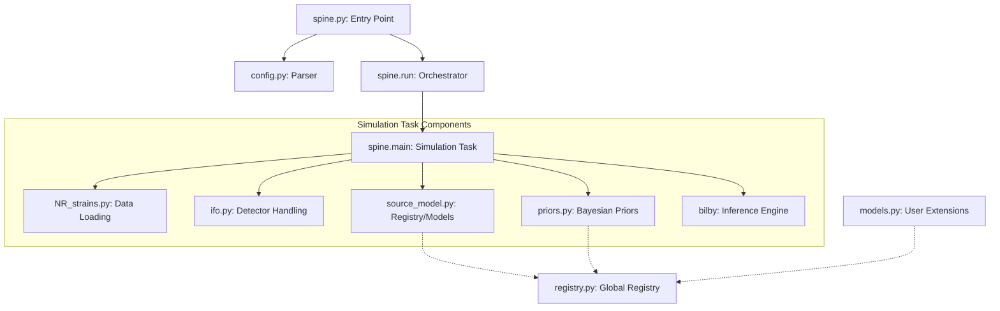
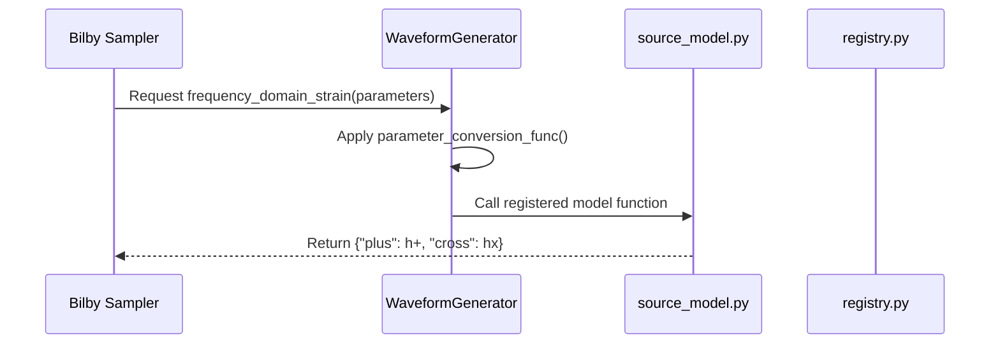

# gw_pipe: Architectural Overview

This document provides a sketch of the library's functionality, component interactions, and execution flow.

## 1. High-Level Hierarchy

The library follows a modular design where core orchestration is decoupled from physics models and configuration parsing.

## 2. Execution Flow

The typical workflow follows these steps:

1. **Configuration Parsing**:
    * `spine.py` reads the `.cfg` file via `config.py`.
    * `create_iterator_dict()` generates a Cartesian product of all parameters (e.g., multiple SNR values x multiple models).
2. **Simulation Orchestration**:
    * `spine.run()` manages a `multiprocess.Pool` to run several simulations in parallel.
3. **Individual Simulation (`main`)**:
    * **Data Preparation**: `NumericalData` loads the NR waveform (plus/cross) and metadata.
    * **Injection**: `InterferometerHandler` takes the NR signal and injects it into a simulated detector network (H1, L1, V1) with or without Gaussian noise.
    * **Model Lookup**: The `ModelRegistry` retrieves the requested waveform model and its parameter conversion function.
    * **Prior Setup**: `get_priors()` finds the relevant `.priors` file and applies empirical relations (e.g., $f_{\mathrm{peak}}$ predictions).
    * **Sampling**: Bilby runs the chosen sampler (`dynesty` or `pocomc`) to perform the Bayesian parameter estimation.
    * **Cleanup**: Results are saved as JSON and PDF plots in a structured output directory.

## 3. Component Breakdown

| Component | Responsibility | Key Class/Function |
| :--- | :--- | :--- |
| **spine.py** | Entry point and parallel orchestration. | `run()`, `main()` |
| **config.py** | Handles `.cfg` files and produces task iterators. | `Config` |
| **registry.py** | Central hub for model and conversion discovery. | `ModelRegistry` |
| **source_model.py**| Built-in physics models for post-merger signals. | `lorentzian`, `easter_model` |
| **models.py** | User-facing file to add custom GW models. | `@register_model` |
| **priors.py** | Maps physical parameters to Bayesian priors. | `get_priors()` |
| **ifo.py** | Interfaces with Bilby detectors and injections. | `InterferometerHandler` |
| **NR_strains.py** | Low-level loading of NR data (BAM, THC, etc.). | `NumericalData` |
| **global_vars.py** | Consistent paths and constant management. | `project_path` |

## 4. How Models are Called

When `bilby` evaluates the likelihood, it calls the `WaveformGenerator`. The generator then calls the function registered in our logic:

---
*Created by Antigravity*
